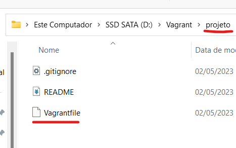
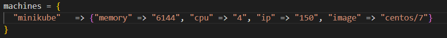
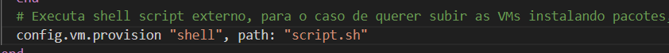
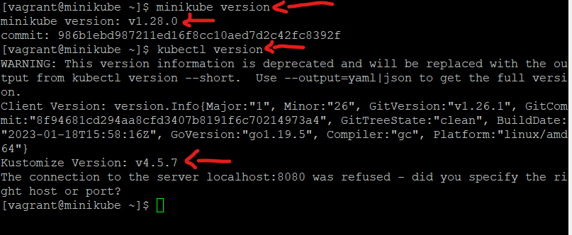


## Vagrant - Provisionando Minikube (Kubernetes local) para estudos e testes

Será criado de forma rápida e objetiva uma VM com minikube pronto para uso, para ser usado durante o desenvolvimento e testes.

No exemplo a seguir serão criados uma VM no VirtualBox, que terá a seguinte identificação:

| Hostname   | IP       |
| :---------- | :--------- |
| minikube | 192.168.56.150 |

### Observação

Minikube só é recomendado para testes e estudos sobre Kubernetes.

### Requisitos mínimos

Ter em seu SO os seguintes softwares.
Abaixo de cada um segue o link para download.

- VirtualBox (Software de virtualização)

  https://www.virtualbox.org/wiki/Downloads

- Vagrant (Software para configurar ambientes)

  https://developer.hashicorp.com/vagrant/downloads

- Putty (Software de cliente remoto)

  https://www.chiark.greenend.org.uk/~sgtatham/putty/latest.html

### Siga as etapas

1 - Crie uma pasta com nome de sua preferência em qualquer lugar do seu SO. No meu caso vou chama lá de “**projeto**” e dentro dela crie um arquivo chamado **Vagrantfile**, sem extensão.



2 - Nosso arquivo **Vagrantfile** terá algumas configurações pontuais para nossa única VM.

- **SO:** CentOS 7
- **Hostname:** minikube
- **IP:** 192.168.56.150
- **CPU:** 4
- **Memória RAM:** 6



Ainda dentro do **Vagrantfile**, criaremos um apontamento para o arquivo **script.sh**, que será nosso script externo.

Esse arquivo terá todos os passos de preparação do Minikube na VM.



Depois de tudo configurado, salve o arquivo.

Detalhes de como configurar o arquivo **Vagrantfile**, acesse o link.

https://github.com/tiagotsc/vagrant-basico_vms

3 - Agora dentro da pasta **projeto**, crio o arquivo **script.sh** de fato.


E coloque o seguinte conteúdo:

https://github.com/tiagotsc/vagrant-minikube/blob/948079cecfa86fa6db65e72b2cc1b4a8ae9a2567/script.sh#L1-L26

Depois de inserir o conteúdo, salve o arquivo.

4 - Via linha de comando, dentro da pasta “**projetos**”, vamos subir nossa VM, execute:

```bash
# Liga ou cria a VM, caso ainda não existam
vagrant up
```


O processo demora um pouco e todos os passos que são executados podem ser acompanhados em tempo real via linha de comando.

5 - Quando todo o processo terminar, abra o putty e forneça o IP da VM:

**IP:** 192.168.56.150

**Usuário:** root ou vagrant

**Senha:** vagrant


Na figura abaixo, já estando logado na VM, é possível ver a versão do Minikube e kubectl já pronto para uso.

```bash
# Ver versão do minikube
minikube version
# Ver versão do kubectl
kubectl version
```



O mesmo pode ser feito nas outras VMs, caso queira acessá-las.

### Alguns comandos úteis

Via linha de comando, é preciso estar na pasta "**projeto**", pasta aonde está o Vagrantfile,  para executar os comando.

```bash
# Desliga VM
vagrant up

# Reiniciar VM
vagrant reload

# Destruir VM
vagrant destroy
```

#### Documentação oficial do Vagrant

https://developer.hashicorp.com/vagrant/docs

#### Documentação oficial do Minikube
https://minikube.sigs.k8s.io

## 🔗 Links
[](https://www.linkedin.com/in/tiago-s-costa)
