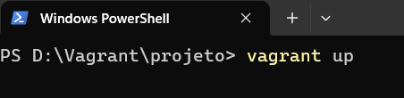
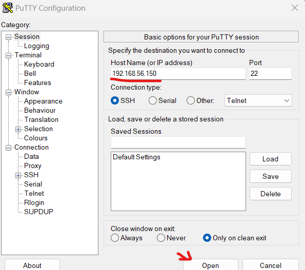

## Vagrant - Provisionando Minikube (Kubernetes local) para estudos e testes

Será criado de forma rápida e objetiva uma VM com minikube pronto para uso, para ser usado durante o desenvolvimento e testes.

No exemplo a seguir será criado uma VM no VirtualBox, que terá a seguinte identificação:

| Hostname   | IP       |
| :---------- | :--------- |
| minikube | 192.168.56.150 |

### Observação

Minikube só é recomendado para testes e estudos sobre Kubernetes.

### Requisitos mínimos

Ter em seu SO os seguintes softwares.
Abaixo de cada um segue o link para download.

- VirtualBox (Software de virtualização)

  https://www.virtualbox.org/wiki/Downloads

- Vagrant (Software para configurar ambientes)

  https://developer.hashicorp.com/vagrant/downloads

- Putty ou MobaXterm (Software de cliente remoto)

  https://www.chiark.greenend.org.uk/~sgtatham/putty/latest.html

  https://mobaxterm.mobatek.net/download-home-edition.html

### Siga as etapas

1 - Crie uma pasta com nome de sua preferência em qualquer lugar do seu SO. No meu caso vou chama lá de “**projeto**” e dentro dela crie um arquivo chamado **Vagrantfile**, sem extensão.


2 - O arquivo **Vagrantfile** terá algumas configurações pontuais para nossa única VM.

- **SO:** CentOS 7
- **Hostname:** minikube
- **IP:** 192.168.56.150
- **CPU:** 4
- **Memória RAM:** 6


Ainda dentro do **Vagrantfile**, criaremos um apontamento para o arquivo **script.sh**, que será nosso script externo com toda a instalação do Minikube.


Conteúdo completo arquivo Vagrantfile

https://github.com/tiagotsc/vagrant-minikube/blob/948079cecfa86fa6db65e72b2cc1b4a8ae9a2567/script.sh#L1-L61

Depois de tudo configurado, salve o arquivo.

3 - Agora dentro da pasta **projeto**, crie o arquivo **script.sh** .


E coloque o seguinte conteúdo:

https://github.com/tiagotsc/vagrant-minikube/blob/948079cecfa86fa6db65e72b2cc1b4a8ae9a2567/script.sh#L1-L26

Depois de inserir o conteúdo, salve o arquivo.

4 - Via linha de comando, dentro da pasta “**projetos**”, vamos subir nossa VM, execute:

```bash
# Liga ou cria a VM, caso ainda não existam
vagrant up
```



O processo demora um pouco e todos os passos que são executados podem ser acompanhados em tempo real via linha de comando.

5 - Quando todo o processo terminar, abra o putty e forneça o IP da VM:

**IP:** 192.168.56.150

**Usuário:** root ou vagrant

**Senha:** vagrant



Na figura abaixo, já estando logado na VM, é possível ver a versão do Minikube e kubectl já pronto para uso.

```bash
# Ver versão do minikube
minikube version
# Ver versão do kubectl
kubectl version
```


### Alguns comandos úteis

Via linha de comando, é preciso estar na pasta "**projeto**", pasta aonde está o Vagrantfile,  para executar os comando.

```bash
# Liga VM, ou cria, caso ainda não exista
vagrant up

# Desliga a VM
vagrant halt

# Reiniciar a VM
vagrant reload

# Destrói a VM, mas pergunta antes
vagrant destroy

# Destrói a VM sem perguntar
vagrant destroy -f
```

Tudo o tutorial aplicado já se encontra pronto para uso nesse repositório, basta clonar e subir o ambiente.

#### Documentação oficial do Vagrant

https://developer.hashicorp.com/vagrant/docs

#### Documentação oficial do Minikube
https://minikube.sigs.k8s.io

## 🔗 Links
[](https://www.linkedin.com/in/tiago-s-costa)
